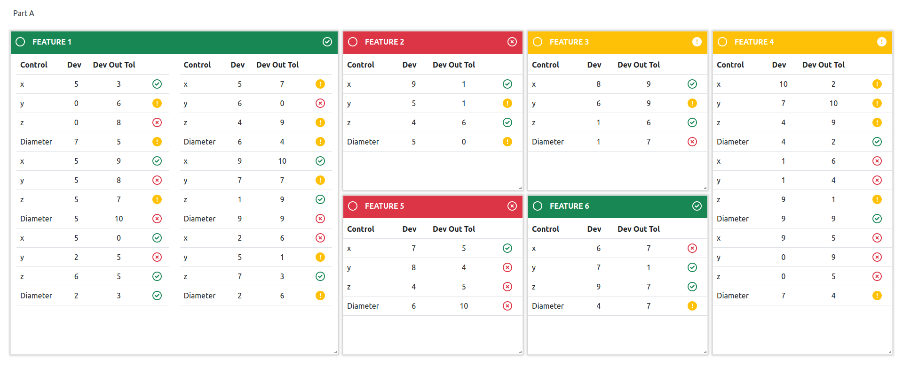

# Solución para la prueba de Frontend para ABB

## Comentarios sobre la solución

Para conseguir más fácilmente el aspecto de la interfaz me he apoyado en las
siguientes librerías:

* La biblioteca de componentes React-Bootstrap. 
* La biblioteca react-grid-layout para hacer los paneles de características y
  permitir arrastrarlos y redimensionarlos (aunque esto último no es de mucha
  utilidad).

Soy consciente de que usar estas librerías puede ir en contra de lo que dice el
enunciado sobre la potencia del hardware en el que debería ejecutarse el
front-end.

Aunque no se exigía, he realizado un pequeño back-end para servir
la página web así como para enviar los datos de las medidas simuladas desde el
servidor hacia el frontend usando WebSockets. Me parecía bonito hacer que se
pareciese a algo real.

Reconozco que la forma en la que se maneja el estado asociado a los
datos de las medidas puede provocar que el cambio de un solo dato dispare el
re-renderizado de toda la interfaz, lo cual es ineficiente y más si el
hardware no es potente. Si es necesario, puedo mejorar esto.

Aunque en el enunciado se dice que el periodo de refresco de las medidas debía
ser de 10 segundos, he ajustado un periodo de 5 segundos para que no haya que
esperar mucho tiempo a que lleguen datos.

Hay algunos detalles del diseño de la interfaz que no he conseguido reproducir
con fidelidad. Por ejemplo, el icono con la exclamación no tiene el mismo estilo
que el resto y tampoco he colocado el rectángulo con los tres puntos situado
en la parte inferior de los paneles.

La indicación de la calidad de las _features_ mediante el color
y el icono de la barra de título de cada panel no guarda relación con la calidad
de las medidas que contiene, sino que es también aleatoria.

## Instalación

He escrito el back-end usando la versión de Node v16.14.0. Espero que no haya
muchos problemas si se usa una versión parecida. Si es necesario, puedo
cambiar a la versión que me indiquéis para que podáis probarlo sin problemas.

### Pasos de instalación

Desde una ventana de terminal, clonar el repositorio con el código mediante:

    $ git clone https://github.com/victormsc/abb_frontend_assignment.git

Cambiar al directorio con la parte de front-end, instalar los módulos necesarios
y generar los ficheros de la aplicación:

    $ cd abb_frontend_assignment/src/front-end
    $ npm install
    $ npm run webpack:dev

En la versión de desarrollo está activado el _watch_ de webpack para
reempaquetar al vuelo los cambios, por lo que el terminal queda ocupado.

Si se prefiere la versión de producción, cambiar la última línea por

    $ npm run webpack:prod

Ahora, situarse de nuevo en el directorio donde se clonó el repositorio, abrir
otra ventana de terminal e introducir

    $ cd abb_frontend_assignment/src/back-end
    $ npm install
    $ npm run start:dev

Se generará la aplicación del servidor y éste quedará escuchando el puerto 3000.

Seguidamente, abrir un navegador web y acceder a la siguiente dirección:

    http://localhost:3000

Inicialmente todos los paneles de medidas aparecerán vacíos y en verde pero
después de 5 segundos deberían aparecer las primeras medidas y refrescarse
también cada 5 segundos.

Por favor, si ocurre algún problema durante la instalación o pruebas,
indicádmelo y lo solucionaré lo antes posible.
